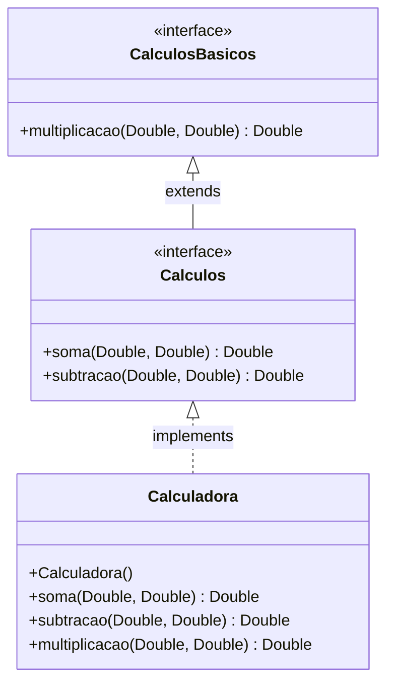
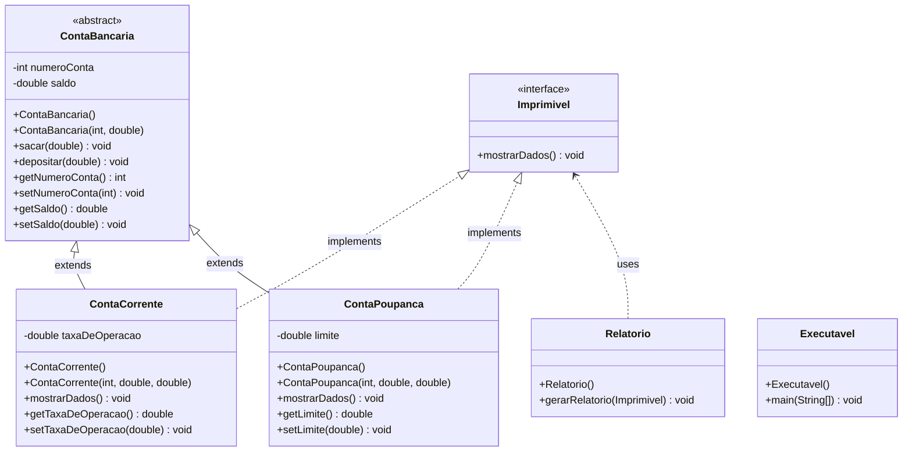
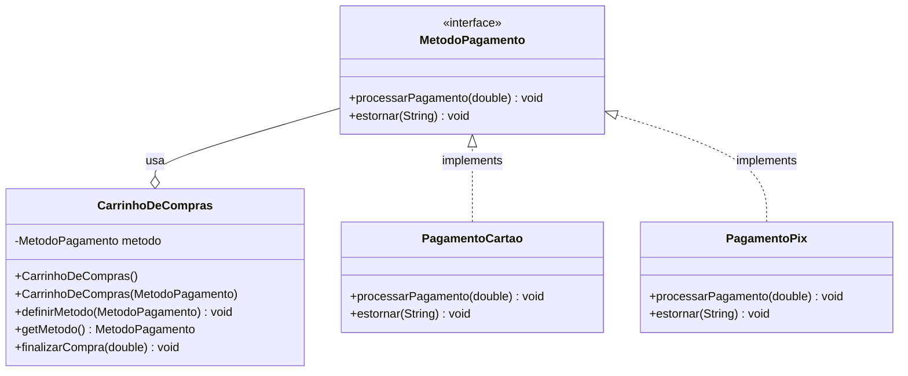

# ☕ Java Object-Oriented Programming (OOP) Showcase

A curated collection of Object-Oriented Programming (OOP) projects and exercises in Java, designed to demonstrate clean code architecture, design patterns, interface-driven development, and UML-to-code realization.

---

## 📁 Repository Structure

```text
Java-programming/
├── .gitignore
├── README.md
└── src/
    ├── InterfaceCalculator/
    │   ├── CalculosBasicos.java
    │   ├── Calculos.java
    │   ├── Calculadora.java
    │   └── Main.java
    ├── Bank_System/
    │   ├── Imprimivel.java
    │   ├── ContaBancaria.java
    │   ├── ContaCorrente.java
    │   ├── ContaPoupanca.java
    │   ├── Relatorio.java
    │   └── Executavel.java
    └── EcommercePaymentGateway/
        ├── MetodoPagamento.java
        ├── PagamentoCartao.java
        ├── PagamentoPix.java
        ├── CarrinhoDeCompras.java
        └── Main.java
```

---

## 🧮 Project 01: Interface-Driven Calculator

Demonstrates **interface inheritance** (`extends` between interfaces) and strict contract implementation (`implements`).

### UML Class Diagram



---

## 🏦 Project 02: Polymorphic Banking System

A bank account model applying **Abstraction**, **Inheritance**, **Encapsulation**, and **Polymorphism** through interfaces.

### Core Features
- **Abstraction:** Generic abstract class `ContaBancaria` providing reusable deposit and withdrawal business rules.
- **Inheritance & Encapsulation:** Specialized accounts (`ContaCorrente` and `ContaPoupanca`) extending the base account with encapsulated fees and limits.
- **Decoupled Polymorphism:** A reporting engine (`Relatorio`) that consumes any entity implementing `Imprimivel` without tight coupling to concrete classes.
- **Defensive Programming:** Parameter validation, balance verification, and formatted monetary outputs (`R$ 0.00`).

### UML Class Diagram



---

## 🛒 Project 03: E-Commerce Payment Gateway (Strategy Pattern)

An e-commerce payment processing module demonstrating the **Strategy Pattern** (GoF) to support interchangeable payment algorithms at runtime.

### Core Features
- **Strategy Design Pattern:** Decouples payment execution and refund operations from the shopping cart context (`CarrinhoDeCompras`) via the `MetodoPagamento` interface.
- **Open/Closed Principle (OCP):** New payment gateways (e.g. Crypto, Boleto, PayPal) can be added cleanly without altering existing shopping cart logic.
- **Polymorphic Execution:** The cart seamlessly delegates processing to whichever concrete strategy is active (`PagamentoCartao`, `PagamentoPix`).
- **Defensive Validation:** Null-checks against unassigned payment methods, positive amount assertions, and transaction identifier sanitization.

### UML Class Diagram



---

## 🚀 How to Run

### Prerequisites
- JDK 17 or higher
- Git
- Any Java IDE (IntelliJ IDEA, Eclipse, VS Code)

### Running via Terminal
1. Clone the repository:
   ```bash
   git clone https://github.com/DevFarias11/Java-programming.git
   cd Java-programming
   ```
2. Compile and run **Project 01 (Calculator)**:
   ```bash
   javac -d bin src/InterfaceCalculator/*.java
   java -cp bin InterfaceCalculator.Main
   ```
3. Compile and run **Project 02 (Banking System)**:
   ```bash
   javac -d bin src/Bank_System/*.java
   java -cp bin Bank_System.Executavel
   ```
4. Compile and run **Project 03 (E-Commerce Payment Gateway)**:
   ```bash
   javac -d bin src/EcommercePaymentGateway/*.java
   java -cp bin EcommercePaymentGateway.Main
   ```